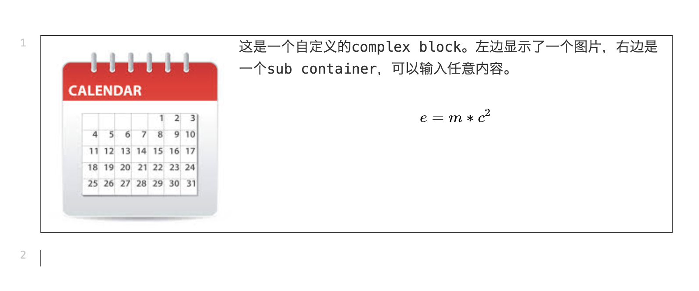

# 创建自定义的 complex block

wiz-editor支持增加自定义的complex类型的block。这种block类似与表格，code这样的block。
这种block里面，又包含了一个或者多个container，每一个container里面，都可以进行独立编辑，
插入除了complex block之外的所有block（也可以仅允许插入指定类型的block，例如code）。

要实现一个complex 类型的block，必须实现下面的方法

```ts
export interface Block {
  //block options
  getBlockOptions?: () => BlockOptions;
  createBlockTemplateData: (editor: Editor, options: any) => BlockTemplateData;
  createBlockContent: (editor: Editor, id: string, data: BlockData) => BlockContentElement;
  updateBlockData: (block: BlockElement, data: BlockData) => void;
  saveData: (block: BlockElement) => BlockData;
  getChildContainersData?: (block: BlockElement) => ContainerData[];
  getCaretPos: (block: BlockElement, node: Node, nodeOffset: number) => number;
  createRange: (block: BlockElement, pos: number) => Range;
  getSubContainerInComplexBlock?: (block: BlockElement, element: HTMLElement, type: 'top' | 'right' | 'bottom' | 'left') => ContainerElement | null;
  replaceChildrenId?: (doc: EditorDoc, data: DocBlock) => void;
}
```

实现Block之后，需要进行注册：

```ts
import {
  blockUtils,
} from 'wiz-editor/client';

const testBlock = {
  ...
};

blockUtils.registerEmbed('test-block' as BLOCK_TYPE, testBlock);
```

demo



```ts
const TEST_BLOCK_TYPE = 'test';
// ------------------ create a custom complex block -------
(() => {
  interface TestComplexBlockTemplateData {
    imgSrc: string;
  };

  interface TestComplexBlockData extends TestComplexBlockTemplateData, BlockData {
  }

  function createBlockTemplateData(editor: Editor, options: TestComplexBlockTemplateData) {
    //
    const blocks = [
      blockUtils.createBlockData(editor, BLOCK_TYPE.TEXT, {
        text: new RichTextDocument([]),
      }),
    ];
    //
    const containerId = editor.createEmptyChildContainerData(blocks, genId());
    const children = [containerId];
    //
    return {
      children,
      ...options,
    };
  }

  function createBlockContent(editor: Editor, id: string, data: BlockData): BlockContentElement {
    //
    assert(data);
    const blockData = data as TestComplexBlockData;
    const blockContent = document.createElement('div') as unknown as BlockContentElement;
    blockContent.style.border = '1px solid';
    blockContent.style.display = 'flex';
    blockContent.style.alignItems = 'end';
    const img = document.createElement('img');
    img.src = blockData.imgSrc;
    blockContent.appendChild(img);
    //
    assert(blockData.children);
    assert(blockData.children.length === 1);
    const subContainerId = blockData.children[0];
    const containerBlocks = editor.getChildContainerData(subContainerId);
    const container = editor.createChildContainer(blockContent, subContainerId, containerBlocks);
    assert(container);
    return blockContent;
  }

  function getChildImage(block: BlockElement): HTMLImageElement {
    assert(blockUtils.isBlock(block));
    assert(blockUtils.getBlockType(block) === (TEST_BLOCK_TYPE as any));
    const content = blockUtils.getBlockContent(block);
    assert(content.children.length === 2);
    assert(content.children[0] instanceof HTMLImageElement);
    return content.children[0];
  }

  function getChildContainer(block: BlockElement): ContainerElement {
    assert(blockUtils.isBlock(block));
    assert(blockUtils.getBlockType(block) === (TEST_BLOCK_TYPE as any));
    const content = blockUtils.getBlockContent(block);
    assert(content.children.length === 2);
    const container = content.children[1] as ContainerElement;
    return container;
  }

  function saveData(block: BlockElement): BlockData {
    assert(block);
    //
    const subContainer = getChildContainer(block);
    const subContainerId = containerUtils.getContainerId(subContainer);
    const children = [subContainerId];
    const id = blockUtils.getBlockId(block);
    const image = getChildImage(block);
    //
    const blockData: TestComplexBlockData = {
      id,
      type: TEST_BLOCK_TYPE as any,
      text: new RichTextDocument([]),
      children,
      imgSrc: image.src,
    };
    return blockData;
  }

  function updateBlockData(block: BlockElement, data: BlockData) {
    //
    const newData = data as TestComplexBlockData;
    //
    const oldData = saveData(block) as TestComplexBlockData;
    assert(oldData.children);
    assert(newData.children);
    assert(oldData.children[0] === newData.children[0]);
    //
    if (oldData.imgSrc !== newData.imgSrc) {
      //
      const image = getChildImage(block);
      image.src = newData.imgSrc;
    }
  }

  function getChildContainersData(block: BlockElement): ContainerData[] {
    //
    const content = getChildContainer(block);
    const containerId = containerUtils.getContainerId(content);
    const blocks: BlockData[] = [];
    containerUtils.getAllBlocks(content).forEach((childBlock) => {
      const blockData = blockUtils.saveData(childBlock);
      blocks.push(blockData);
    });
    return [{
      id: containerId,
      blocks,
    }];
  }

  // eslint-disable-next-line no-unused-vars
  function getCaretPos(block: BlockElement, node: Node, nodeOffset: number): number {
    const container = getChildContainer(block);
    if (node === container) {
      assert(nodeOffset === 0 || nodeOffset === 1);
      return nodeOffset;
    }
    // sub blocked has been deleted, ignore
    return 0;
  }

  function createRange(block: BlockElement, pos: number): Range {
    assert(block);
    assert(pos === 0 || pos === -1 || pos === 1);
    //
    const container = getChildContainer(block);
    assert(container);
    const blocks = containerUtils.getAllBlocks(container);
    const childBlock = pos === 0 ? blocks[0] : blocks[blocks.length - 1];
    assert(childBlock);
    const offset = pos === 0 ? 0 : -1;
    const ret = blockUtils.createRange(childBlock, offset);
    return ret;
  }

  function getSubContainerInComplexBlock(block: BlockElement,
    element: HTMLElement, type: 'top' | 'right' | 'bottom' | 'left') {
    //
    assert(type);
    return null;
  }

  function getBlockOptions(): BlockOptions {
    return {
      textBlock: false,
      complexBlock: true,
    };
  }

  function replaceChildrenId(editorDoc: EditorDoc, blockData: DocBlock): void {
    const doc = editorDoc;
    const children = blockData.children;
    assert(children);
    const oldId = children[0];
    assert(oldId);
    const newId = genId();
    doc[newId] = doc[oldId];
    delete doc[oldId];
    // eslint-disable-next-line no-param-reassign
    blockData.children = [newId];
  }

  // eslint-disable-next-line no-unused-vars
  function executeBlockCommand(block: BlockElement, command: BlockCommand, params?: CommandParams): any {
    assert(blockUtils.getBlockType(block) === (TEST_BLOCK_TYPE as any));
    //
  }

  // eslint-disable-next-line no-unused-vars
  function handleBlockLoaded(block: BlockElement) {
    //
  }

  function accept(type: BOX_TYPE | BLOCK_TYPE): boolean {
    assert(type);
    // accept all non-complex blocks
    return true;
  }

  const TestComplex: Block = {
    getBlockOptions,
    createBlockTemplateData,
    createBlockContent,
    updateBlockData,
    saveData,
    getChildContainersData,
    getCaretPos,
    createRange,
    getSubContainerInComplexBlock,
    replaceChildrenId,
    executeBlockCommand,
    handleBlockLoaded,
    accept,
  };

  blockUtils.registerBlockType(TEST_BLOCK_TYPE as any, TestComplex);
})();

...

document.getElementById('complex-block')?.addEventListener('click', () => {
  assert(currentEditor);
  const blockData = blockUtils.createBlockData(currentEditor, TEST_BLOCK_TYPE as any, {
    imgSrc: CALENDAR_IMAGE_URL,
  });
  currentEditor.insertBlock(null, -2, 'test' as any, blockData, {
    fromUndo: false,
    focusToBlock: true,
    localAction: true,
  });
});

```

[查看例子](../../h5/src/custom.ts)
