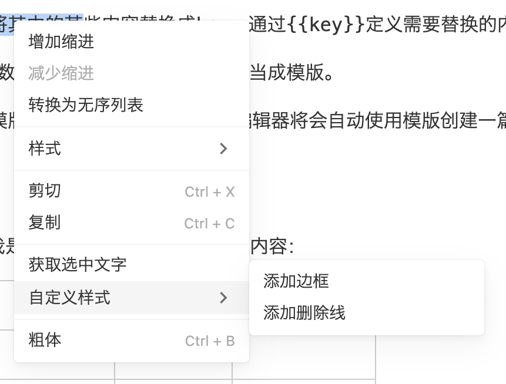

# 演示：添加自定义菜单

在创建编辑器的时候，可以通过选项，增加自定义菜单（右键菜单）。



下面是一个例子：

```ts
// 当用户点击菜单的时候，将会执行相应的方法
function handleMenuItemClicked(item: MenuItemData) {
  console.log(item);
  assert(currentEditor);
  if (item.id === 'get-selected-text') {
    alert(`selected text: ${currentEditor.getSelectedText()}`);
  } else if (item.id === 'add-border') {
    currentEditor.applyTextCustomStyle('style-border');
  } else if (item.id === 'add-strikethrough') {
    currentEditor.applyTextCustomStyle('style-strikethrough');
  }
}

// 在用户点击右键的时候，编辑器将会调用这个方法。
// 在这个回调方法里面，可以根据当前选中的信息，返回是否需要添加自定义菜单。
function handleGetContextMenuItems(detail: SelectionDetail): MenuItemData[] {
  if (detail.collapsed) {
    return [];
  }
  const ret: MenuItemData[] = [];
  ret.push({
    id: 'get-selected-text',
    text: '获取选中文字',
    shortCut: '',
    disabled: false,
    onClick: handleMenuItemClicked,
  }, {
    id: 'test id 2',
    text: '自定义样式',
    shortCut: '',
    disabled: false,
    subMenu: [
      {
        id: 'add-border',
        text: '添加边框',
        shortCut: '',
        disabled: false,
        onClick: handleMenuItemClicked,
      },
      {
        id: 'add-strikethrough',
        text: '添加删除线',
        shortCut: '',
        disabled: false,
        onClick: handleMenuItemClicked,
      },
    ],
  });
  return ret;
}

...

const options = {
    ...
    callbacks: {
      ...
      // 设置自定义菜单回调方法
      onGetContextMenuItems: handleGetContextMenuItems,
    },
  };
};
```


