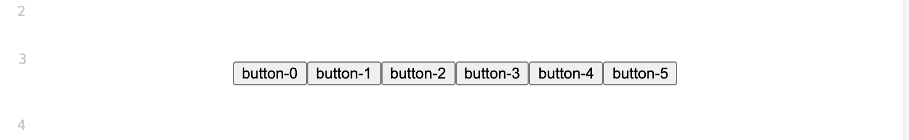

# 创建自定义的 embed block

wiz-editor支持增加自定义的embed类型的block。这种block类似与图片，视频, Office文件等这样的block，用户可以将光标定位在这种block前面后者后面，但是不能将光标定位在block里面。

block内容是一个任意的HTMLElement，里面也可以包含任意元素。

embed block定义：

```ts
export interface EmbedData {
  [index: string]: any;
};

export interface Embed {
  // 返回一个EmbedElement（就是HTMLElement）
  createElement(editor: Editor, data: EmbedData): EmbedElement;
  // 保存数据： 从EmbedElement里面保存数据
  saveData(editor: Editor, embed: EmbedElement): EmbedData;
  // 更新数据（例如从服务器更新新的数据）到界面（dom）
  updateData(editor: Editor, embed: EmbedElement, data: EmbedData): void;
  // 获取工具栏按钮，可以不实现
  getToolbarOptions?: (block: BlockElement, target: Element) => ToolbarOptions | null;
};
```

实现Embed之后，需要进行注册：

```ts
import {
  embedUtils,
} from 'wiz-editor/client';

const buttonsEmbed = {
  createElement,
  saveData,
  updateData,
};

embedUtils.registerEmbed('buttons' as EMBED_TYPE, buttonsEmbed);
```

demo



```ts
// -------------------custom embed block----------------

(() => {
  interface EmbedButtonsData extends EmbedData {
    count?: number;
  }

  function handleButtonClick(event: Event) {
    const button = event.target as HTMLButtonElement;
    alert(`you clicked button ${button.innerText}`);
  };
  //

  function createElement(editor: Editor, data: EmbedData): EmbedElement {
    assert(data);
    const div = document.createElement('div');
    const child = document.createElement('div');
    div.appendChild(child);
    //
    const buttonsData = data as EmbedButtonsData;
    const count = buttonsData.count || 10;
    //
    div.setAttribute('data-count', `${count}`);
    //
    for (let i = 0; i < count; i++) {
      const button = document.createElement('button');
      button.innerText = `button-${i}`;
      button.onclick = handleButtonClick;
      child.appendChild(button);
    }
    //
    return div as unknown as EmbedElement;
  }

  function saveData(editor: Editor, embed: EmbedElement): EmbedData {
    assert(embed instanceof HTMLDivElement);
    const count = Number.parseInt(embed.getAttribute('data-count') || '10', 10);
    return {
      count,
    };
  }

  function updateData(editor: Editor, embed: EmbedElement, data: EmbedData): void {
    assert(embed instanceof HTMLHRElement);
    assert(data);
    //
    assert(embed.children.length === 1);
    const child = embed.children[0];
    child.innerHTML = '';
    //
    const buttonsData = data;
    const count = buttonsData.count || 10;
    //
    for (let i = 0; i < count; i++) {
      const button = document.createElement('button');
      button.innerText = `button-${i}`;
      button.onclick = handleButtonClick;
      child.appendChild(button);
    }
  }

  const buttonsEmbed = {
    createElement,
    saveData,
    updateData,
  };

  embedUtils.registerEmbed('buttons' as EMBED_TYPE, buttonsEmbed);
})();

...

document.getElementById('buttons')?.addEventListener('click', () => {
  assert(currentEditor);
  const count = (Date.now() % 5) + 5;
  currentEditor.insertEmbed(null, -2, 'buttons' as any, {
    count,
  });
});
```

[查看例子](../../h5/src/custom.ts)

